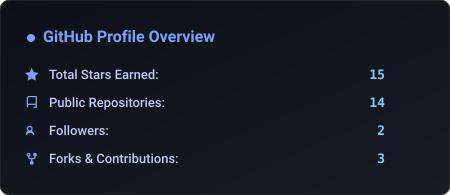
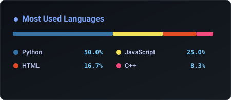

  <!-- Local Custom Banner -->
  

    

  <!-- Social & Competitive Programming Badges -->
  
  
  
  
  
  

---

### 👨‍💻 About Me

I am an **AI & Data Science undergraduate** at **Pune Institute of Computer Technology (PICT)** *(B.Tech in AI & DS, 2024–2028 | CGPA: 8.99)*, with a strong foundation in software engineering, data structures, machine learning, and computer vision.

My focus is on building real-time AI applications and end-to-end intelligent systems that connect machine learning models with practical software infrastructure.

- 🔭 **Focus:** Architecting real-time AI applications, computer vision systems, and intelligent automation workflows.
- 💡 **Passion:** Translating machine learning research into practical, end-to-end production systems.
- ⚡ **Strengths:** Rapid prototyping, systems thinking, hackathon leadership, and clean Python/C++ development.

---

### 🛠️ Tech Stack

| Domain | Technologies |
| :--- | :--- |
| **Languages** |    |
| **AI & Machine Learning** |      |
| **Web & Backend** |     |
| **Database** |  |
| **Tools & Platforms** |    |

 

  

---

### 🚀 Featured Projects

<table>
  <tr>
    <td width="50%" valign="top">
      <h3 align="center">🚁 SkyNetra</h3>
      
<strong>AI-Powered Autonomous Drone Response System</strong>

      
<em>Apr 2026 • INSPIRON 5.0 Finalist (COEP Hackathon — Team Lead)</em>

      
An intelligent urban safety system designed for real-time incident detection and autonomous emergency drone dispatching.

      <ul>
        <li>Integrated <strong>YOLOv8</strong> and <strong>OpenCV</strong> for low-latency visual threat and anomaly detection.</li>
        <li>Architected automated response pipelines to reduce situational dispatch delay.</li>
        <li>Designed as an end-to-end AI-powered emergency response workflow.</li>
      </ul>
       
      

        
      

    </td>
    <td width="50%" valign="top">
      <h3 align="center">🌊 LinguaQuest</h3>
      
<strong>Interactive Language Learning Platform</strong>

      
<em>Aug 2025 • Tech-Rush Hackathon Finalist (PICT IEEE)</em>

      
A gamified web application designed to make French and German language learning intuitive and engaging for young students.

      <ul>
        <li>Designed an interactive underwater-themed UI with engaging learning feedback.</li>
        <li>Built responsive feedback loops for learning interactions.</li>
        <li>Engineered structured learning modules using <strong>HTML5</strong>, <strong>CSS3</strong>, and <strong>JavaScript</strong>.</li>
      </ul>
       
      

        
      

    </td>
  </tr>
</table>

---

### 📊 GitHub Analytics

  <table border="0">
    <tr>
      <td>
        
      </td>
      <td>
        
      </td>
    </tr>
  </table>
   
  

---

### 📜 Certifications

- 🏅 **Machine Learning Specialization** — *DeepLearning.AI & Stanford University (Andrew Ng)* `[Jul 2026]`
- 🧩 **Data Structures & Algorithms** — *Regal Classes* `[Nov 2025 – Mar 2026]`
- 🐍 **Python for Data Science** — *IIT Madras (NPTEL)* `[Apr 2025 | Score: 80%]`

---

### 🤝 Beyond Code & Leadership

- 💡 **AI Teaching Volunteer** | *PICT Community Engagement Project* — Facilitated 40+ hours of foundational AI and technology workshops for 4th-grade students.
- 🌐 **Active Member** | *Computer Society of India (CSI), PICT Chapter* — Participating in technical events, coding contests, and peer mentoring.
- 📋 **Data Management Volunteer** | *Impetus and Concepts (InC) Flagship Event Team* — Coordinated participant workflows and event data tracking.

---

  ### 💬 Let's Connect & Collaborate

  *Open for AI/ML projects, open-source collaborations, and research opportunities.*

   

  
  &nbsp;
  
  &nbsp;
  
  &nbsp;
  
  &nbsp;
  
  &nbsp;
  

    

  

